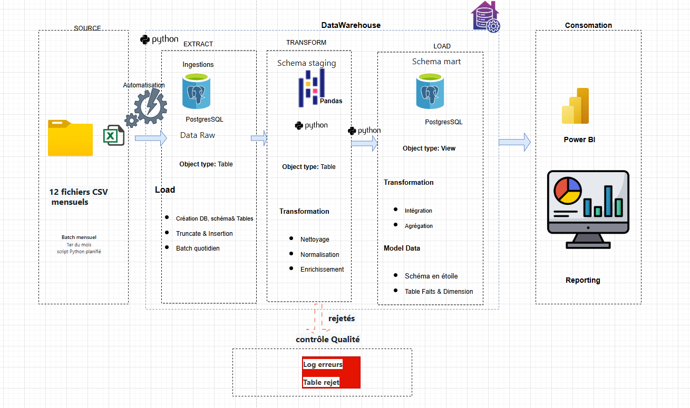
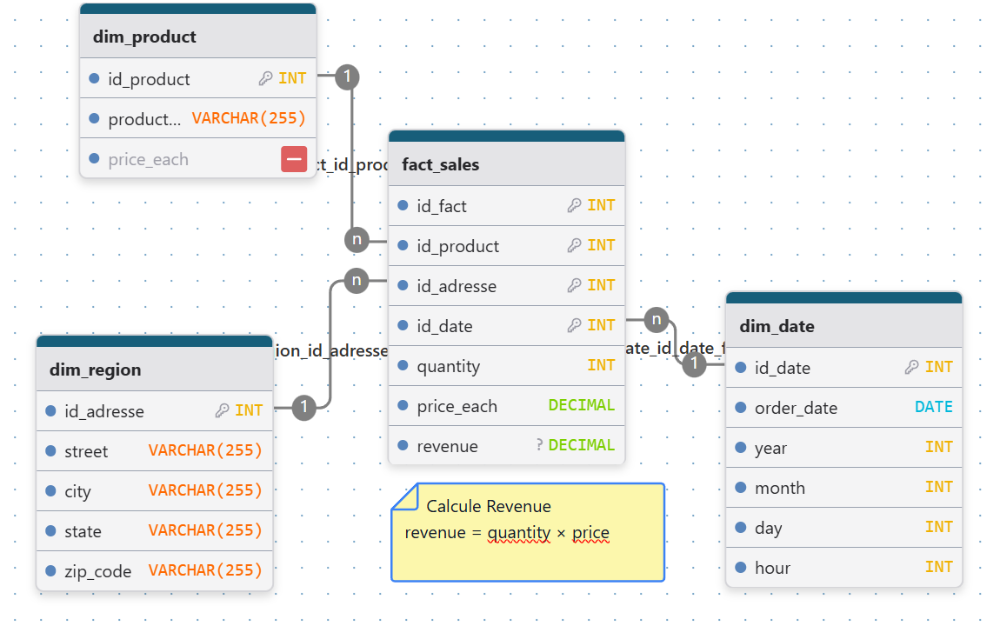

# 🚀 Sales Intelligence USA, Automated ETL Pipeline

## 📌 Business Context

This project analyzes **U.S. sales performance for 2019**.

Raw data is distributed across **12 monthly CSV files**, containing:

* missing values
* inconsistent formats
* no analytical structure

### 🎯 Objective

Build an **automated ETL pipeline** to:

* consolidate data
* clean and standardize it
* transform it into a **Star Schema**
* load it into a PostgreSQL data warehouse for BI usage

* 
<p align="center">
  
  <br>
  <em>Figure: ETL Sales Data Warehouse</em>
</p>
---

## 📊 Key Results

| Metric                   | Result                 |
| ------------------------ | ---------------------- |
| Transactions processed   | 186,000+               |
| Source files             | 12 monthly CSVs        |
| Revenue concentration    | ~80% from top products |
| Pipeline automation      | 100%                   |
| Manual processing time   | Eliminated             |
| Data quality improvement | +15%                   |

---

## 🛠 Tech Stack

| Technology       | Purpose                          |
| ---------------- | -------------------------------- |
| Python (Pandas)  | Data extraction & transformation |
| PostgreSQL       | Data warehouse                   |
| SQLAlchemy       | Database connection              |
| Psycopg2         | PostgreSQL driver                |
| Jupyter Notebook | Data exploration                 |
| Logging          | Monitoring & debugging           |

---

## 🏗 Data Architecture — Star Schema

<p align="center">
  
</p>

---

## ⭐ Fact Table: `fact_sales`

**Granularity:** one row per order line

### Measures:

* `quantity`
* `price`
* `revenue = quantity × price`

### Keys:

* `id_product`
* `id_date`
* `id_adresse`
* `Order_ID`

---

## 📦 Dimension Tables

### 🧾 `dim_product`

* product_name
* price

👉 Deduplicated product list

---

### 🌎 `dim_region`

* street
* city
* state
* zip_code

👉 Extracted from `Purchase_Address`

---

### 📅 `dim_date`

* full_date
* year
* month
* day
* hour

👉 Enables time-based analysis

---

## ❗ Modeling Decision

### Why no `dim_order`?

* `Order_ID` already exists in fact table
* No additional attributes (customer, channel…)

➡️ Avoids unnecessary complexity
➡️ Improves query performance

---

## 🔄 ETL Pipeline

### 1️⃣ Extract & Clean

* Automatically loads all `Sales_*.csv` files
* Merges them into a single dataset
* Removes:

  * empty rows
  * invalid records (`,,,,`)
* Converts data types:

  * dates → datetime
  * quantities → numeric
  * prices → float

---

### 2️⃣ Transform (Star Schema)

* Builds dimension tables using `drop_duplicates()`
* Generates surrogate keys (`id_*`)
* Parses addresses into structured fields
* Joins dimensions to create `fact_sales`
* Computes revenue:

```python
revenue = quantity * price
```

---

### 3️⃣ Load (PostgreSQL)

* Uses SQLAlchemy for database connection
* Loads tables with `to_sql()`
* Replaces existing tables automatically

---

## 🔐 Reliability & Monitoring

* Full logging:

  * extraction
  * transformation
  * loading
* Automatic `.log` file generation
* Error handling with `try/except`
* Reproducible pipeline

---


## 📊 BI & Analytics (Power BI)

Connect PostgreSQL to Power BI.

### Available KPIs:

* 💰 Monthly revenue
* 📦 Top-selling products
* 🌎 Sales by city/state
* 🕒 Sales by hour
* 📊 Transaction volume

---

## 💡 Project Value

✔ Raw CSV → Structured Data Warehouse
✔ Fully automated ETL pipeline
✔ BI-ready data model (Star Schema)
✔ Scalable and production-ready design
✔ Improved data quality & reliability

---

## 👤 Author

**Jean-Yves KPANGBAN**
Data Analyst | Python · SQL · Power BI

🔗 https://linkedin.com/in/jean-yves-kpangban-66259619a
